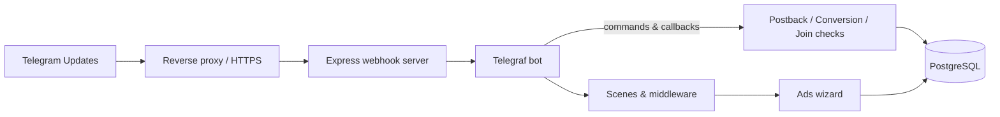

# Architecture

## High-level components

```mermaid
graph TD
  subgraph HTTP Layer
    server["src/api/server.js\nWebhook server"]
    app["src/api/app.js\ncreateApp()"]
    click["src/api/click.js"]
    cpa["src/api/cpa.js"]
    wa["src/api/wa.js"]
  end

  subgraph Bot Layer
    telegraf["src/bot/telegraf.js\nTelegraf bot"]
    wizard["src/bot/adsWizard.js\nAds wizard scene"]
    stat["src/bot/stat.js\nStat commands"]
    linkCapture["src/bot/link-capture.js"]
    sessionStore["src/bot/sessionStore.js"]
  end

  subgraph Services
    postback["src/services/postback.js"]
    conversion["src/services/conversion.js"]
    joinCheck["src/services/joinCheck.js"]
  end

  subgraph Persistence
    db["src/db/index.js"]
    migrate["src/db/migrate.js"]
  end

  utilId["src/util/id.js"]
  utilPricing["src/util/pricing.js"]
  utilGeo["src/util/geo.js"]
  utilXtr["src/util/xtr.js"]

  server --> app
  app --> click
  app --> cpa
  app --> wa
  server --> telegraf
  telegraf --> wizard
  telegraf --> stat
  telegraf --> linkCapture
  telegraf --> sessionStore
  telegraf --> postback
  telegraf --> conversion
  telegraf --> joinCheck
  telegraf --> utilId
  telegraf --> utilPricing
  telegraf --> utilXtr
  wizard --> db
  wizard --> utilPricing
  wizard --> utilGeo
  postback --> db
  postback --> utilId
  conversion --> db
  conversion --> postback
  conversion --> utilId
  joinCheck --> db
  click --> db
  cpa --> db
  wa --> db
  app --> db
  db --> migrate
```

## Runtime data flow



The HTTP entrypoint (`src/api/server.js`) boots an Express app with JSON parsing, webhook guard middleware and a small REST surface for offer administration. Telegram updates go directly into `bot.handleUpdate`. Admin APIs authenticate via `ADMIN_TOKEN` and talk to the database using `src/db/index.js` helpers.

The Telegraf layer wires session storage to PostgreSQL, dynamically loads optional middleware (`link-capture`), and registers commands, actions and scenes. Offer creation and updates are handled inside `adsWizardScene`, which orchestrates pricing adjustments and conversion payouts.

CPA click tracking and debug tools live in `src/api/app.js` and reuse the same database helpers. Conversion and join processing share the `sendPostback` service to deliver signed notifications to partner systems.
