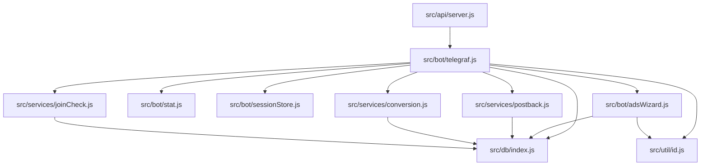

# Architecture

## Module dependencies


## Update flow
```mermaid
graph LR
  tg[Telegram Updates]
  nginx[Nginx / HTTPS terminator]
  express[Express app\n(src/api/server.js)]
  telegraf[Telegraf bot\n(src/bot/telegraf.js)]
  stage[Scenes.Stage middleware]
  adsWizard[adsWizardScene]

  tg --> nginx --> express --> telegraf --> stage --> adsWizard
  telegraf -->|other handlers| botHandlers[Commands, actions, joins]
  botHandlers --> services[Postback / Conversion / Join checks]
  services --> db[(PostgreSQL)]
```
